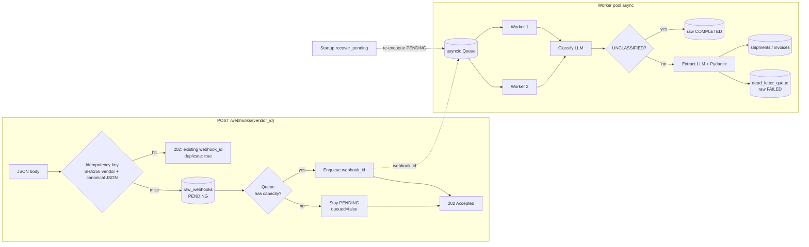

# AI Webhook Ingestion Service

Lightweight **FastAPI** service that:

1. **Accepts** any JSON body on `POST /webhooks/{vendor_id}` and returns **202 Accepted** without waiting for the LLM.
2. **Classifies** payloads with an LLM as `SHIPMENT_UPDATE`, `INVOICE`, or `UNCLASSIFIED`.
3. **Normalizes** `SHIPMENT_UPDATE` and `INVOICE` into strict [Pydantic](https://docs.pydantic.dev/) schemas, validates them, and **persists** rows in **SQLite** (async).
4. Routes failures to a **dead-letter** table with error context.

## Quick start

```bash
cd ai-webhook-ingestion-service
python3 -m venv .venv
source .venv/bin/activate
pip install -r requirements.txt
cp .env.example .env
# Default is Groq: set GROQ_API_KEY=gsk_... in .env. Use LLM_PROVIDER=mock for offline dev/tests.
uvicorn app.main:app --reload --port 8000
```

- **Ingestion:** `POST /webhooks/{vendor_id}` with arbitrary JSON.
- **Health:** `GET /health`

## LLM configuration


| Env            | Meaning                                             |
| -------------- | --------------------------------------------------- |
| `LLM_PROVIDER` | `groq` (default) or `mock` (offline dev/tests)      |
| `GROQ_API_KEY` | Required when using Groq (default); omit for `mock` |
| `GROQ_MODEL`   | e.g. `llama-3.3-70b-versatile`                      |

For details about design and decisions, see the [Design](#design) and [Design Q&A](#design-qa) sections below.

## LLM Prompting strategy

Classification and extraction are **two separate LLM calls**. The first only decides the message type; the second maps the payload into our fields using that type’s rules. Keeping routing and extraction apart is more reliable than asking for both in one response.

### 1. Classify first

The model returns **JSON only** (no markdown): a `type` field—one of our business labels, or **unclassified** when the payload does not clearly match a label or there is too little to normalize.

The prompt states **when** each label applies. This step does not extract or normalize fields; it only classifies the message.

### 2. Extract second

Given the chosen type, the extraction prompt includes:

- A short **task line** (what to extract, required fields, allowed values where relevant).
- A **schema hint** (expected types and constraints).
- The **full webhook body** as the source.

The instructions require the model to **stay tied to the source**: no invented values, no placeholder defaults (empty strings, zeros, fake statuses, etc.). Vendors often use **different property names** than our schema; the model should map them when the link is clear, not declare a field missing only because the key name differs. When the value is present but the **format** is wrong (number as string, odd timestamp format, status text that does not match our enum literals), normalize only when the correct value follows clearly from the source; task-line examples are **guides**, not a full list of exhaustive examples.

If a required value is missing, ambiguous (e.g. a time where the instant is unclear without a timezone), or no enum choice fits cleanly, the model returns a **small error object** (flag, reason, affected fields) instead of a partial record; that path is treated as a hard failure.

Examples in the prompt illustrate normalization and when to refuse. Copy and rules were refined over repeated testing.

### 3. Retry strategy

Two different mechanisms apply:

1. **Invalid or non‑JSON model output** — The provider asks for JSON-shaped replies, but the assistant text must still parse. If parsing fails (or transient network errors occur), the **same** classify or extract request is **retried automatically** a limited number of times before surfacing an error.
2. **JSON parses, but Pydantic validation fails** — For extraction, the parsed object is validated with **Pydantic**. On failure, we **call the model again** with the same payload and schema context, and we **append the validation errors** to the prompt so the model can correct types, field names, or formats. That loop runs up to a **configured** attempt limit; it is meant to fix encoding and shape issues, not to compensate for missing or ambiguous source data.

After a successful extract, the **vendor id from the URL** overrides whatever the model put in the payload for tenancy.

## Hacks made due to time constraint

Some shortcuts were taken due to time constraints. The left column describes what this codebase does today, while the right column describes what we would add or change for production readiness.


| Current shortcut                                                                                | In production                                                                                                                                  |
| ----------------------------------------------------------------------------------------------- | ---------------------------------------------------------------------------------------------------------------------------------------------- |
| An in-memory asyncio queue is used to store tasks to be processed                               | We will use a durable message broker such as **SQS** or **RabbitMQ** with **DLQs** and proper visibility timeouts.                             |
| A fixed number of worker threads are used as consumers                                          | We will run a separate consumer pool that auto-scales based on the pending backlog.                                                            |
| No authentication or rate limiting is enforced on the webhook endpoint                          | We will add API keys and per-vendor rate limiting at the gateway.                                                                              |
| No proper idempotency is implemented; the same extraction task can be performed multiple times  | We will add distributed deduplication (for example, Redis `SET ... NX` with TTL) to ensure each extraction task is processed only once.        |
| When the queue is full, stuck PENDING rows are mostly recovered on restart.                     | This issue will not occur when using production-grade message brokers like SQS or RabbitMQ, which can handle large bursts of traffic reliably. |
| Observability is limited to basic logging                                                       | We will add structured JSON logs, OpenTelemetry traces, and Prometheus metrics for queue depth, LLM latency, and DLQ volume.                   |
| SQLite is used as the database                                                                  | We will move to Postgres (or another production-grade relational database), with optional partitioning for large `raw_webhooks` tables.        |
| Tables are created with `create_all()` when the app starts (init_db), not via a migration tool. | We will use versioned database migrations using a tool like Alembic.                                                                           |


## Extensibility of schema type

**Schemas are implemented in an extensible way:** new normalized types can be plugged in without rewriting the core pipeline. You can add another type later (for example **XYZ**) without redoing how webhooks are accepted or queued. Vendors keep posting the same way; workers still classify, then extract and validate. Your work is mostly: pick a new label, define its fields, register it so the model knows what it means, save rows somewhere sensible, and update tests or docs if you advertise the new type.

**Steps to add a new schema type**

1. `**app/schemas/base.py`** — Add a new value on the `EventType` enum. That string is what classification should return as `type` for this kind of payload.
2. `**app/schemas/`** — Add a Pydantic model file with the fields you want (required fields, enums, formats). Extraction output is checked against this model.
3. `**app/schemas/registry.py`** — Register the new type: point it at your Pydantic model, add a short line for “when is this XYZ?”, add extraction instructions, optional keyword hints for fuzzy labels, and optional mock output if you use the mock LLM.
4. `**app/models.py`** — Add a table (and a link from raw webhooks if you want) for the normalized row, same idea as shipments and invoices.
5. `**app/services/normalized_handlers.py`** — Add an upsert that writes validated data into that table and map your new `EventType` to that function in the handler dict at the bottom of the file.


## Design

The service is built so vendors get a **fast acknowledgement** while heavy work runs **asynchronously**. The HTTP handler never waits on the LLM: it persists (or short-circuits on dedupe), optionally hands work to a queue, and returns **202 Accepted** with a small JSON body (`webhook_id`, `duplicate`, `queued`).

### Ingestion path (request thread)

1. **Idempotency / deduplication.** A **SHA-256** idempotency key is derived from the path `vendor_id` and a **canonical JSON** representation of the body (sorted keys, stable separators) so equivalent payloads hash the same. The database enforces uniqueness on that key.
2. **Duplicate request.** If a row with that key already exists, the handler **does not** insert another raw row and **does not** enqueue again. It still returns **202** with the **existing** `webhook_id` and `duplicate: true`, so retries or double-submits are cheap and safe.
3. **New request.** A row is written to `**raw_webhooks`** (raw JSON as text, idempotency key, timestamps). The row is **committed** before any consumer can dequeue, so workers always see durable data.
4. **Lifecycle state on the raw row.** Status progresses through `**PENDING`** → `**PROCESSING`** → `**COMPLETED`** or `**FAILED`** (and failures that go through the dead-letter path set `**FAILED`**). A `**queued`** flag records whether the webhook ID was accepted into the in-process queue.
5. **Queue handoff.** Only the **webhook ID** is placed on an `**asyncio.Queue`** (bounded by `QUEUE_MAX_SIZE`). The HTTP response returns immediately—typically **sub-second**, bounded by SQLite I/O and enqueue, not LLM latency.
6. **Queue full.** If the queue is full, the row stays `**PENDING`** with `**queued=false`**; **startup recovery** re-enqueues pending rows so spikes are handled at-least-once after restart.

### Worker path (background)

Multiple **async workers** (count from `WORKER_COUNT`) dequeue IDs **in parallel**. Each worker loads the raw row, sets status to `**PROCESSING`**, then:

1. **Classify** — one LLM JSON call to infer `**SHIPMENT_UPDATE`**, `**INVOICE`**, or `**UNCLASSIFIED**`.
2. **If `UNCLASSIFIED`** — no normalized extract; the raw row is marked `**COMPLETED**` and stops (no shipment/invoice row).
3. **Otherwise** — **extract** with a second LLM call (schema-guided). `**vendorId` in the extracted payload is overwritten** with the path `**vendor_id`** so the URL remains the source of truth for tenancy.
4. **Validate** — parsed through **Pydantic** models from the schema registry. On `**ValidationError`**, the service retries extraction up to `**max_extraction_attempts`** (settings / env `MAX_EXTRACTION_ATTEMPTS`), feeding prior errors back into the prompt (“self-heal”).
5. **Persist** — successful `**SHIPMENT_UPDATE`** / `**INVOICE`** rows are **upserted** into `**shipments`** / `**invoices`**. Hard failures (bad JSON, classification errors, exhausted retries, explicit extraction failure) go to `**dead_letter_queue`** with context, and the raw row ends `**FAILED**`.




## Design Q&A

Short notes on how a few behaviors are implemented and why.

**How are vendors acknowledged with subsecond latency?**  
The ingest path is fully **async**: once a payload is accepted, it is **persisted** to the local database and only the **webhook id** is handed to an **in-process queue**. Classification and extraction run on **background workers**, so the HTTP handler returns **202 Accepted** without waiting on the LLM—latency is dominated by SQLite I/O and enqueue, not model calls.

**How are vendors firing multiple requests with the same payload handled?**  
This is dealt with using **deduplication**: a **SHA-256** idempotency key over `**(vendor_id, canonical JSON payload)`**. If that hash was already stored, the request is treated as a **duplicate**: no second raw row and no re-enqueue; the handler still returns **202** with the **existing** `webhook_id` and `duplicate: true`.

**How is persistence of tasks in the queue dealt with?**  
An **in-memory** queue (`asyncio.Queue`) was used because of **time constraints** on this implementation; a crash therefore **drops** queued ids. On **startup**, `**recover_pending`** loads `**raw_webhooks`** rows that are still `**PENDING`** (including those that never got `queued=true` when the queue was full) and **re-enqueues** them so work is picked up again—**at-least-once** relative to durable rows, not to volatile queue state.